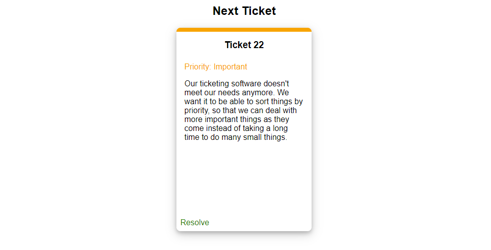

# USU Software Engineering Workshop
Week 1: Ticketing System



## Introduction

Welcome, new intern! You've shown great promise, and our ticket system needs some help. Right
now, our system takes tickets and gives them back to us in the order that they were put in the 
system. We want to address issues in triage-order instead of the way they are right now. Can you 
help us build a solution? The current class is set up 
[here](ticket-api/src/main/java/com/github/ususdw/tickets/TicketQueue.java).

## Running the Project

### IntelliJ
Look on the right side of the screen for a gradle menu with an icon of an elephant. If there is 
nothing contained in the menu, click the plus button and add the `build.gradle` file in the base 
folder of this project.

Expand the Tasks menu and the other menu to show the tasks. Double click any of `runSimulation`, 
`runTests`, and `runServer` to run the API simulation, API tests, and website respectively.

Open your browser to [localhost:8080](http://localhost:8080) to view the results if you are running 
the server.

### Command Line

**API Project Tests**
```
gradlew runTests
```

**API Project Simulations**
```
gradlew runSimulation
```

**Menu Project Server**
```
gradlew runServer
```
Open your browser to [localhost:8080](http://localhost:8080) to view the results.

## Restrictions

The only files that should be modified are the `Ticket` and `TicketQueue` classes. Modification to 
other files is beyond the scope of this project and will likely result in additional errors.

Additionally, for the last component of this workshop, we will be restricted to only manipulating 
the `TicketQueue` class. Using git at each stage is recommended.

## Credits

* The `ticket-menu` project uses the [Spring Framework]() to function.